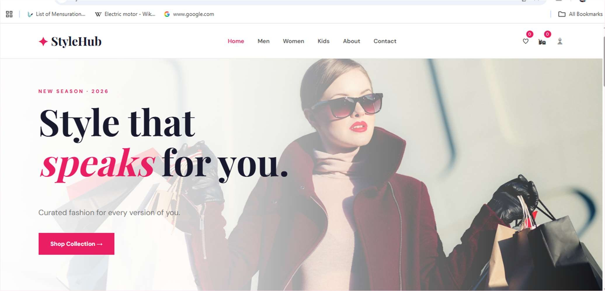
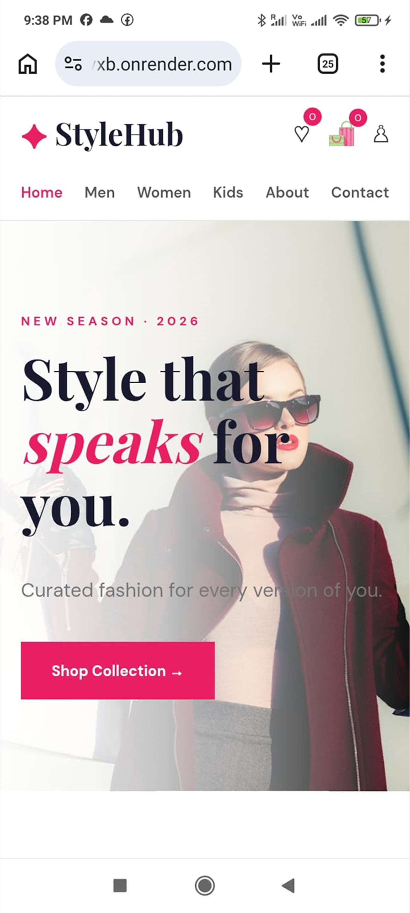
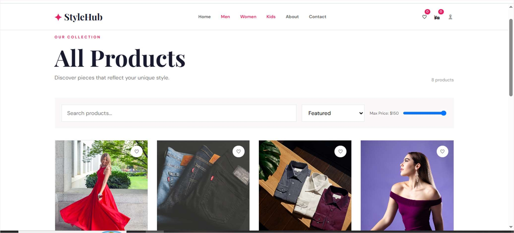
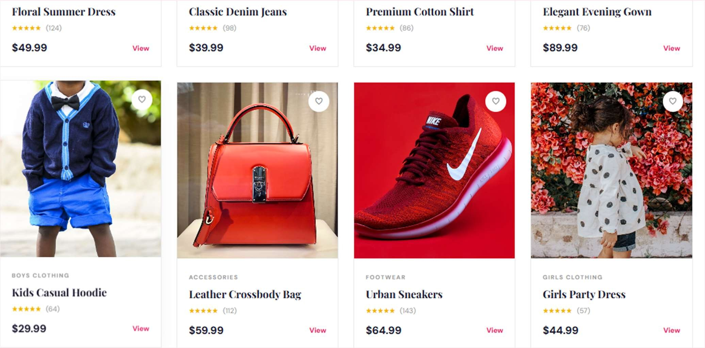
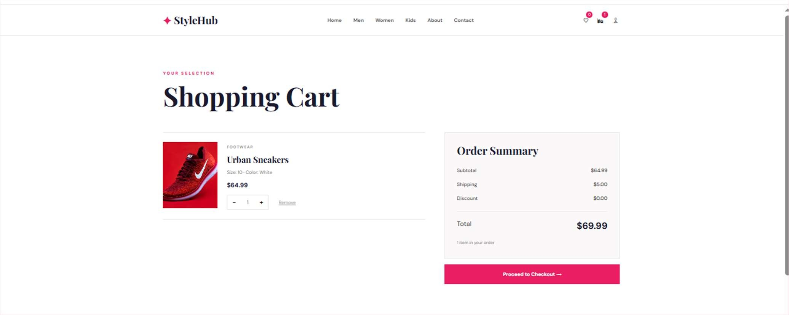
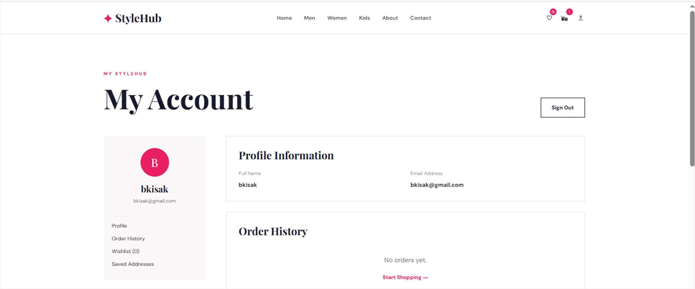

# StyleHub – Fashion & Apparel

> A modern, responsive fashion e-commerce website built with React.js.

**Frontend E-Commerce Website · Web Development Internship**

<p align="left">
  <a href="https://stylehub-cvxb.onrender.com/"></a>
  <a href="https://github.com/isakbk/StyleHub.git"></a>
  <a href="https://youtu.be/bDddPWFBuxc"></a>
</p>

## 🔗 Project Links

| Resource | Link |
|---|---|
| 🌐 Live Website | [https://stylehub-cvxb.onrender.com/](https://stylehub-cvxb.onrender.com/) |
| 💻 GitHub Repository | [https://github.com/isakbk/StyleHub.git](https://github.com/isakbk/StyleHub.git) |
| ▶️ YouTube Demo | [https://youtu.be/bDddPWFBuxc](https://youtu.be/bDddPWFBuxc) |

## 📖 About

StyleHub presents clothing, footwear and accessories for men, women and kids, with product browsing, product details, cart management, wishlist, simulated authentication and a checkout flow. It is frontend-only — no backend or database.

## ✨ Features

- **Home page** – hero banner, categories, featured products and offers
- **Product listing** – search, sorting, category selection and price filtering
- **Product detail** – size, colour, quantity and add-to-cart controls
- **Shopping cart** – quantity adjustment and total calculation
- **Checkout** – shipping details, payment selection and order confirmation
- **Simulated login & registration**
- **Account page** – profile and wishlist information
- **About Us & Contact Us** pages
- **Responsive design** for desktop, tablet and mobile

## 🛠️ Tech Stack

| Technology | Purpose |
|---|---|
| React.js | Frontend framework |
| JavaScript | Logic and data handling |
| HTML5 / CSS3 | Structure and responsive styling |
| React Router | Navigation |
| Vite | Dev server and build tool |
| Render | Deployment |


## 🎨 Design

Pink `#E91E63`, white, dark navy `#1A1A2E` and gold accents with elegant typography, large product imagery and hover effects.

## 📸 Screenshots

### Home Page – Desktop



### Home Page – Mobile



### Product Listing



### Product Cards



### Shopping Cart



### My Account



## 🚀 Getting Started

```bash
git clone https://github.com/isakbk/StyleHub.git
cd StyleHub
npm install
npm run dev
```

Production build:

```bash
npm run build
```

## 🎓 Learning Outcomes

- Component-based React development and Context for state
- Multi-page routing with React Router
- Cart and wishlist logic, filtering with array methods
- GitHub and Render deployment workflow

## 📝 Notes

This is a **frontend-only** project built for educational and demonstration purposes. Data (products, cart, wishlist, users, orders) is simulated in the browser; a production system would need a secure backend, database and real payment integration.

## 👤 Author

**Isak B.K.** · [GitHub @isakbk](https://github.com/isakbk) · bkisak101@gmail.com
>>>>>>> 65f674c (update)
